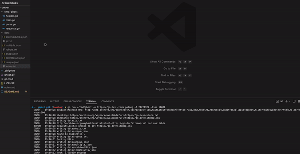

# ghost
a tool for passive recon...ghost gets you the Wayback Machine history for a URL and lets you parse it, saves all archived links, saves an archived robots.txt and sitemap.xml, runs a whois lookup, and gets IP addresses while you're at it.



## Overview
* Supply a URL and get a file containing all archived snapshots. Use -term, -terms, or -regex, to scan each snapshot for a specific word, a list of words (input as a .txt file), or with a regular expression. All search results are saved to a file.
* Customize your search with advanced query filtering.
* In addition to exact URL matching (default), ghost supports URL matching based on -domain, -host, and -prefix.
* ghost retrieves all archived links for the submitted URL prefix, writes the whole set to a file, and parses the set into URLs with a unique snapshot and URLs with multiple iterations. These subsets are written to individual files. 
* You'll also  
ghost performs a concurrent whois lookup and gets the IPv4 and IPv6 addresses for the submitted URL, writing the data to a file in each case. 
* All told, entering a URL gets you the following: 
    * archivedURLs.json
    * ip.txt
    * multiple.json
    * robots.txt
    * sitemap.xml
    * snaps.json
    * unique.json
    * whois.txt. 
* Adding a query yields all of the above plus:
    * termResults.json.

## Example Usage
(find the two most recent results from https://go.dev, starting at 9/22/2022 and using a 10-second timeout.)
```
go run ./cmd/ghost -u https://go.dev -f 20220922 -time 10000 -term go -l -2
```
(download a binary or run go build ./cmd/ghost, then run)
```
echo https://go.dev | ./ghost -f 20220922 -time 10000 -term go -l -2
```
(install with go install ./cmd/ghost, then run)
```
echo https://go.dev | ghost -f 20220922 -time 10000 -term go -l -2
```
## Command-line Options
```
Usage of ghost:
  -g int
    	Number of goroutines (default is 10).
  -regex string
    	Regex pattern for parsing search results.
  -term string
    	Term for parsing search results.
  -terms string
    	Name of a .txt file containing a list of terms for parsing search results.
  -time int
    	Request timeout (in milliseconds). Default is 5000.
  -u string
    	URL for searching.

(query filtering)
  -f string
    	Search from here, including at least a year. Format more specific queries as yyyyMMddhhmmss.
  -l string
    	Limit query results, using -1, -2, -3 etc. for most recent and 1, 2, 3 etc. for oldest.
  -m string
    	Filter results according to mimetype (default is 'text/html').
  -nm string
    	Filter specified mimetype out of results (inactive by default).
  -ns string
    	Filter specified status code out of results (inactive by default).
  -s string
    	Filter results by status code (default is 200).
  -t string
    	Search to here, including at least a year. Format more specific queries as yyyyMMddhhmmss.

(match scope)
  -domain string
    	Return results from host and all subhosts (inactive by default).
  -host string
    	Return results from host (inactive by default).
  -prefix string
    	Return results for all results under the path (inactive by default).
```

## Installation
First, you'll need to [install go](https://golang.org/doc/install).

Then run this command to download + compile ghost:
```
go install github.com/davemolk/ghost/cmd/ghost@latest
```
Alternatively, use one of the binaries available in the release.

## Additional Notes
* Most of ghost's functionality is dependent on the speed of the Wayback Machine APIs. If a search is going slowly or timing out, try running it again before increasing the timeout value.
* Occasionally, a limit of -1 erroneously returns no results (this also happens when using curl or a browser). If you know you should be seeing something and this happens, use limit of -2.
* The query string in formURL contains "fastLatest=true." I haven't noticed an appreciable difference, but it can't hurt, right? Visit [here](https://github.com/internetarchive/wayback/tree/master/wayback-cdx-server) for more details.
* The query string also contains &collapse=digest, which collapses adjacent digests for less cluttered results.
* The whois lookup currently tries just "whois.iana.org." This could expand if there was interest in doing so.

## Support
* Like ghost? Use it, star it, and share with your friends!
* Want to see a particular feature? Found a bug? Question about usage or documentation?
    - Great! Let me know.
* Pull request?
    - Please discuss in an issue first. 

## License
* ghost is released under the MIT license. See [LICENSE](LICENSE) for details.


#### ...the latch was left unhooked...